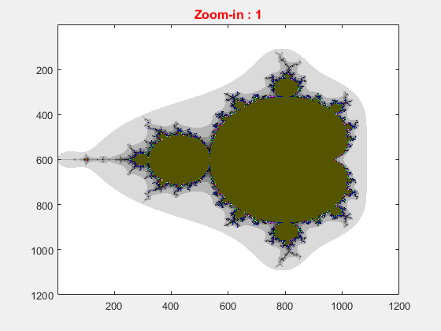

# Mandelbrot set generation with automated zoom-in using Matlab
---
Mandelbrot set is a form of fractal obtained by visualizing convergence of the complex function  with respect to the values of the constant  in the complex plan.

---

## Instructions

No toolbox needed to be installed in Matlab.

---

## Result

This result is obtained for   with  and 

Here, for choosing colors, we use the scalar color maps existing in matlab with:

```bash
colormap jet       % this line can be changed in the file MandelbrotSet_zoom.m
```

we get

<p align="center">
  
</p>

### Change colors

Different color map can be used for instance with:

```bash
colormap colorcube
```

it provides

<p align="center">
  
</p>


with:

```bash
colormap lines
```

it provides

<p align="center">
  
</p>

---
## Copyrights


